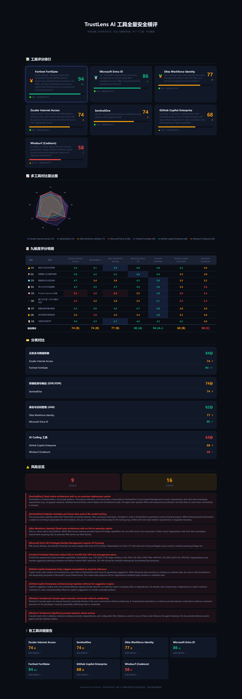

# TrustLens — AI 工具九维度安全评估平台

基于九维度安全框架，对企业级 AI 工具和传统安全工具进行深度安全评估，生成可视化 HTML 报告和高清截图。

## 前端展示

### 评估入口页面


用户输入 AI 工具名称、行业信息后，平台自动爬取官方文档并进行九维度安全评估。

### 评估结果 — 汇总对比



多工具横向对比雷达图、评分排行、分类对比、风险总览，一目了然。

### 评估结果 — 详细报告


每个工具生成独立详细报告，包含：
- 执行摘要（优缺点一目了然）
- 九维度雷达图（SVG）
- 逐项评分（含进度条和百分比）
- 文档证据引用
- 风险清单（高/中/低分级）
- 补偿控制建议
- 一票否决检查

## 评估框架

9 个安全维度，满分 100 分（加权计算）：

| 维度 | 名称 | 权重 |
|------|------|------|
| D1 | 身份认证与访问控制 | 15% |
| D2 | 权限最小化与操作授权 | 20% |
| D3 | 数据流向与主权控制 | 18% |
| D4 | 审计日志与可追溯性 | 15% |
| D5 | Prompt Injection 防御 | 12% |
| D6 | 第三方扩展安全 | 8% |
| D7 | 配置治理与集中管控 | 6% |
| D8 | 成本控制与使用监控 | 4% |
| D9 | 合规与法规对齐 | 2% |

## 已评估工具

| 工具 | 类别 | 得分 | 等级 |
|------|------|------|------|
| Fortinet FortiGate | 云安全 | 94.3 | A+ |
| Microsoft Entra ID | IAM | 86.3 | A |
| Okta Workforce Identity | IAM | 76.9 | B |
| Zscaler Internet Access | 云安全 | 74.4 | B |
| SentinelOne | EDR/XDR | 73.5 | B |
| CrowdStrike Falcon | EDR/XDR | 71.2 | B |
| GitHub Copilot Enterprise | AI Coding | 68.0 | B |
| Cursor | AI Coding | 58.4 | C |
| Windsurf (Codeium) | AI Coding | 58.4 | C |

## 快速开始

```bash
# 安装依赖
npm install

# 启动 Web 前端
node app.js
# 打开 http://localhost:3000

# 命令行评估
node cli.js --tool "Cursor" --industry tech

# 生成所有报告（从 JSON 数据）
node generate_reports.mjs

# 注入执行摘要到报告
node inject_exec_summary.mjs

# 导出高清截图（需 Puppeteer）
node screenshot_reports.mjs
```

## 项目结构

```
trustlens/
├── index.html              # Web 前端入口
├── app.js                  # Express 后端服务
├── cli.js                  # CLI 命令行工具
├── styles.css              # 全局样式
├── tools_list.yaml         # 工具列表配置
├── lib/
│   ├── scorer.js           # 九维度评分引擎
│   ├── analyzer.js         # 文档分析器
│   ├── crawler.js          # 文档爬虫
│   ├── reporter.js         # 基础报告生成
│   └── detailed_reporter.js # 详细报告生成（含雷达图）
├── report_*.html           # 生成的评估报告
├── screenshots/            # 高清 PNG 截图
└── *_analysis.json         # 原始分析数据
```

## License

MIT
